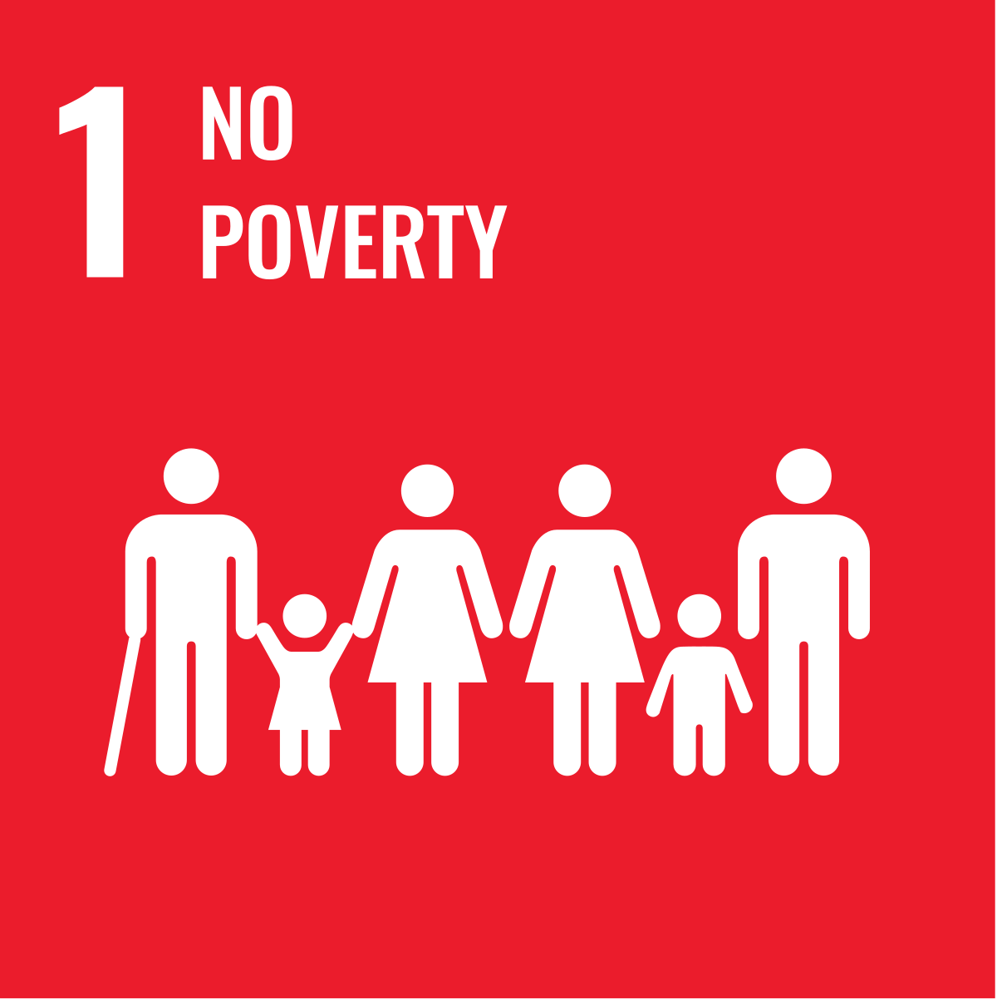
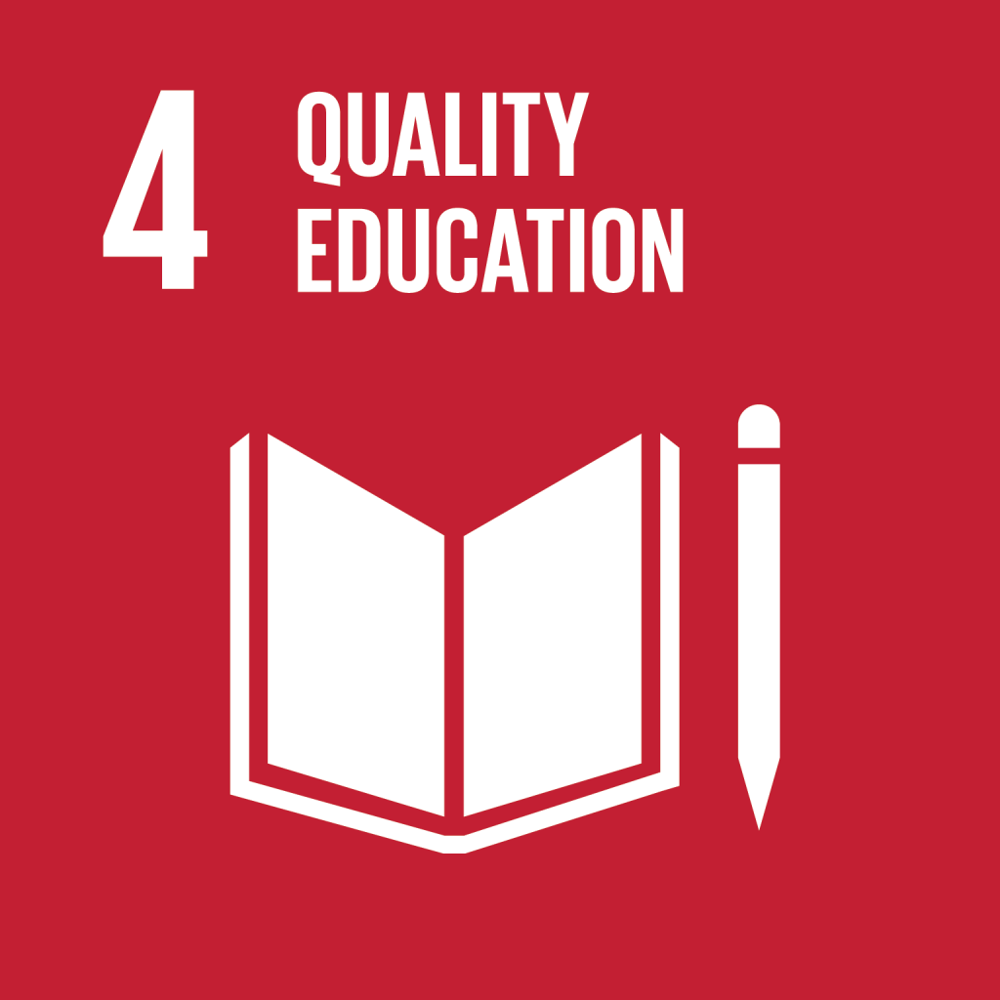
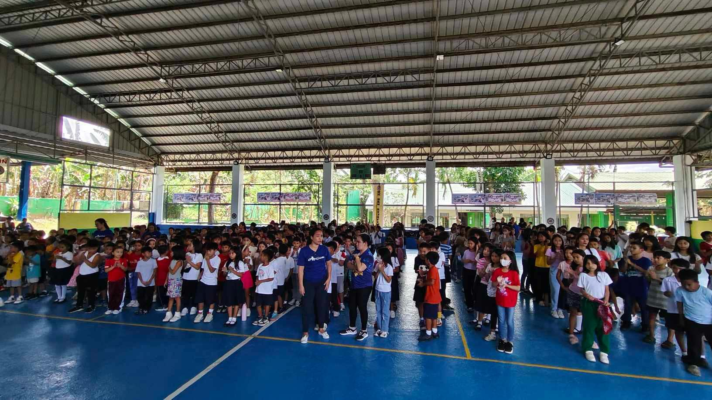
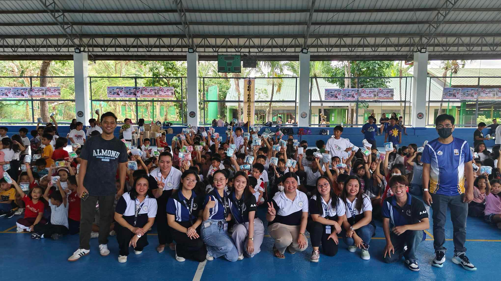
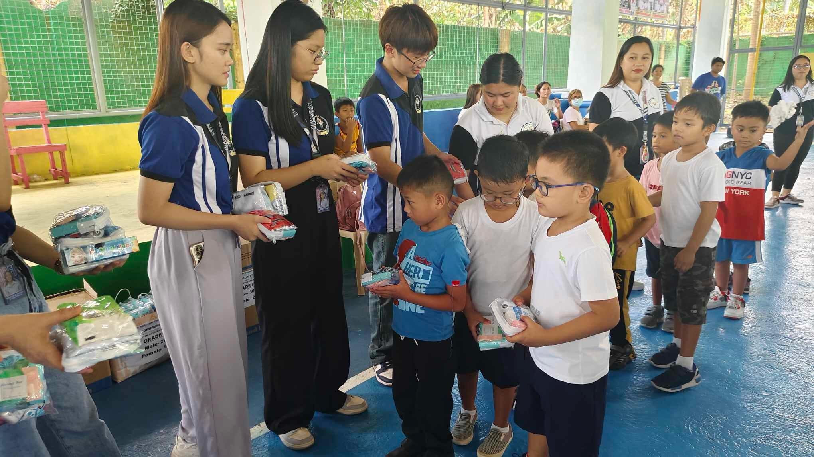
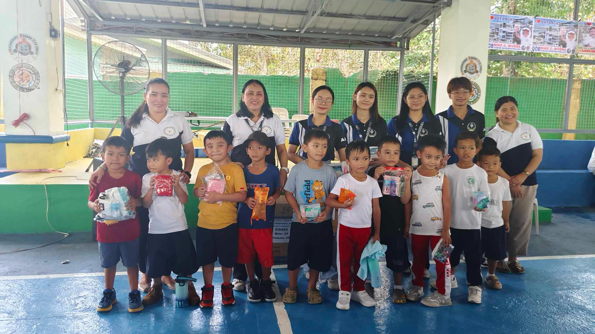
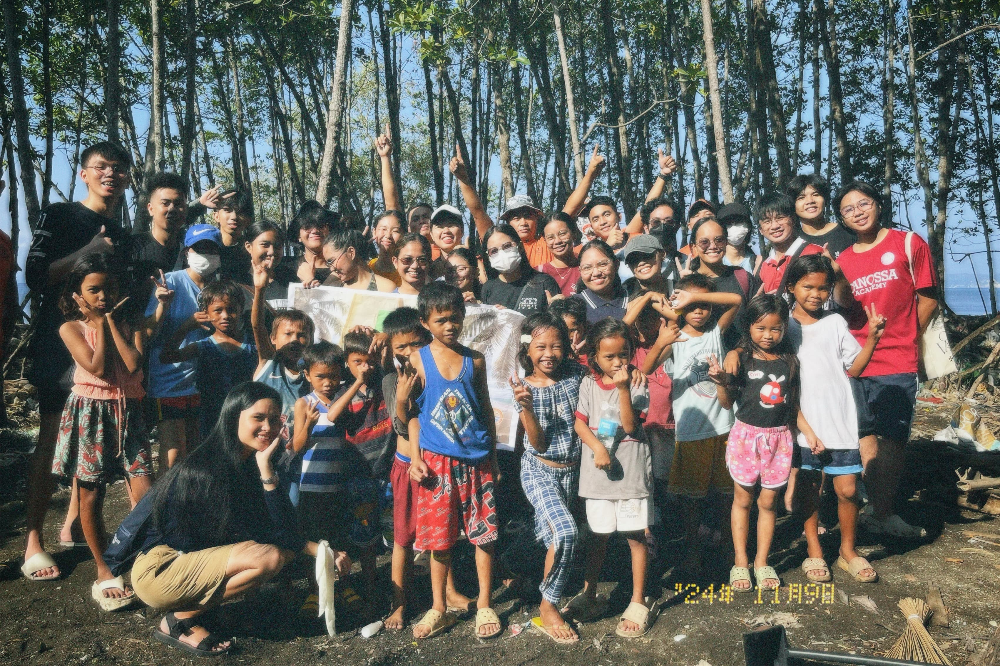
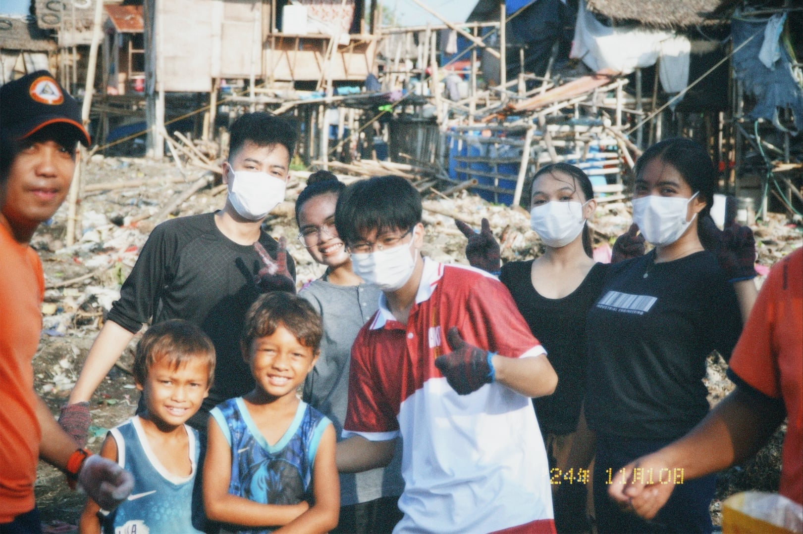
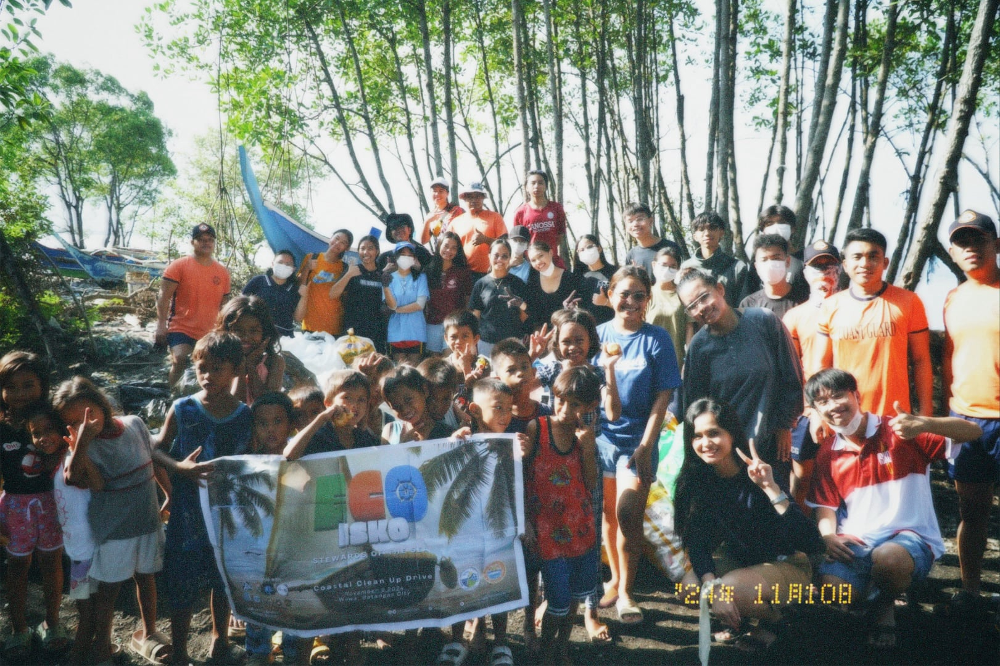
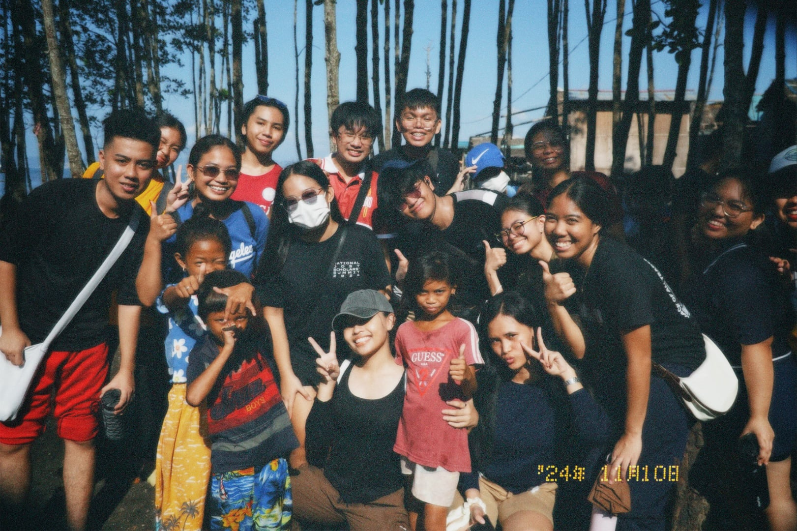

<!DOCTYPE html>
<html lang="en">
<head>
    <meta charset="UTF-8">
    <meta name="viewport" content="width=device-width, initial-scale=1.0">
    <title>My Portfolio</title>
    <link rel = "stylesheet" href="style.css" />
    <link rel = "stylesheet" href="mediaqueries.css" />

</head>
<body>
    <nav id="desktop-nav"> 
        
 John Laurence Mendoza 

        
 
            <ul class="nav-links"> 
                <li><a href="#about"> About </a></li>
                <li><a href="#field"> Field of Interest </a></li>
                <li><a href="#sdg"> SDG </a></li>
                <li><a href="#affiliations"> Affiliations </a></li>
                <li><a href="#contacts"> Contacts </a></li>
            </ul>
        

    </nav>

    <nav id="hamburger-nav">
        
 John Laurence 

        
 
        
 
            
            
            
        

        
 
                <li><a href="#about" onclick= "toggleMenu()"> About </a></li>
                <li><a href="experience" onclick= "toggleMenu()"> Experiences </a></li>
                <li><a href="#sdg" onclick= "toggleMenu()"> SDG </a></li>
                <li><a href="#sdg" onclick= "toggleMenu()" > Projects </a></li>
                <li><a href="#contacts" onclick= "toggleMenu()" > Contacts </a></li>

        
            

        

    </nav>
    <section id="profile">
        
 
            
        

        

            
 Hello, I'm  

            <h1 class="title"> John Laurence </h1>
            
 Software Engineer 

            

                <button class="btn btn-color-2" onclick="window.open('./assets/Resume-CV.pdf')"> 
                    Download CV </button>

                <button class="btn btn-color-1" onclick="location.href='#contacts'">
                        Contact Info </button>
            

            

                

                
            

        

    </section>

    <section id="about"> 
        
 Get to Know More 

        <h1 class="title"> About Me </h1>
        

            
 
                
            

            
 
                
 
                    

                        
                        <h3> Experiences </h3>
                        
 1 year   Front End Development

                    

                    

                        
                        <h3> Education </h3>
                        
 Science, Technology Engineering and Mathematics   Bachelors of Science in Computer Science

                    

                

                    

                        
 <b> Hi! I'm Laurence</b>, an aspiring software engineer and enthusiastic leader with a vision for a brighter future. I’m fueled by a passion for innovation, teamwork, and making meaningful contributions to the world around me. My dream is to achieve success while empowering others to reach their full potential and serving our country with integrity and dedication. I believe in the power of giving back to the community, creating opportunities for growth, and inspiring positive change. With a heart full of ambition and a drive to lead with purpose, I’m excited to embrace every challenge and turn dreams into reality! 

                    

            

        
 
        
    </section>

    <section id="field">
        
 Explore My 

        <h1 class="title"> Field of Interest </h1>
        

        

            

                <h2 class="field-sub-title"> Interests </h2>
                
 
                    <article>
                        
                        

                            <h3> Computer Science</h3>
                            
 Solving problems with technology.

                        

                    </article>
                    <article>
                        
                        

                            <h3> Photography</h3>
                            
 Capturing moments creatively

                        

                    </article>
                    <article>
                        
                        

                            <h3> Public Speaking</h3>
                            
 Engaging audiences confidently

                        

                    </article>
                    <article>
                        
                        

                            <h3> Fashion Arts</h3>
                            
 Expressing creativity through style

                        

                    </article>
                    <article>
                        
                        

                            <h3> Cosmology</h3>
                            
 Exploring the universe's mysteries

                        

                    </article>
                    <article>
                        
                        

                            <h3> Music</h3>
                            
 Listening to Kpop, POP, and OPM

                        

                    </article>
                

            

            

                <h2 class="field-sub-title"> Talents and Hobbies </h2>
                
 
                    <article>
                        
                        

                            <h3> Dancing</h3>
                            
 Expressing through movement

                        

                    </article>
                    <article>
                        
                        

                            <h3> Singing</h3>
                            
 Not a great singer but Kareoke is Life!

                        

                    </article>
                    <article>
                        
                        

                            <h3> Hosting</h3>
                            
Leading events with charm 

                        

                    </article>
                    <article>
                        
                        

                            <h3> Travelling</h3>
                            
 Exploring new places and cultures

                        

                    </article>
                    <article>
                        
                        

                            <h3> Leadership</h3>
                            
 Inspiring and guiding teams 

                        

                    </article>
                    <article>
                        
                        

                            <h3> Technology</h3>
                            
 Exploring innovative solutions

                        

                    </article>
                

            

        

        

        

       

        
    </section>

<section id="sdg">
        
Advocating for Sustainable Development Goals

        <h1 class="title-sdg">My Advocacies</h1>
        

          

      
            <!-- No Poverty Advocacy -->
            

              

                
              

              <h2 class="experience-sub-title project-title">No Poverty</h2>
              

                Committed to eradicating poverty and ensuring economic opportunities for all.
              

              

                <button
                  class="btn btn-color-2 project-btn"
                  onclick="location.href='https://sdgs.un.org/goals/goal1'"
                >
                  Learn More
                </button>
              

            

      
            <!-- Equality Education -->
            

              

                
              

              <h2 class="experience-sub-title project-title">Quality Education</h2>
              

                Ensure inclusive and equitable quality education and promote lifelong learning opportunities for all
              

              

                <button
                  class="btn btn-color-2 project-btn"
                  onclick="location.href='https://sdgs.un.org/goals/goal4'"
                >
                  Learn More
                </button>
              

            

            <!-- Gender Equality Advocacy -->
            

                

                  
                

                <h2 class="experience-sub-title project-title">Gender Equality</h2>
                

                  Promoting equal rights and opportunities regardless of gender.
                

                

                  <button
                    class="btn btn-color-2 project-btn"
                    onclick="location.href='https://sdgs.un.org/goals/goal5'"
                  >
                    Learn More
                  </button>
                

              

      
          

        

        
    
    <section> <section id="community-service">
        
Giving Back to the Community

        <h1 class="cs-title">Community Service Projects</h1>
      
        

          <!-- School Donation Program -->
          

            <h2 class="service-title">School Donation Program</h2>
            

                During my senior high school years, I was a member of the Supreme Student Government (SSG). As part of our school’s annual Love Community Action Program, we organized a school donation drive, contributing to meaningful community outreach and fostering a spirit of generosity and compassion among students.
            

            

              
              
              
              
            

          

      
          <!-- Coastal Clean Up Program -->
          

            <h2 class="service-title2">Coastal Clean Up Program</h2>
            

              An initiative focused on cleaning our coasts to promote environmental sustainability and marine life preservation.
            

            

              
              
              
              
            

          

        

        
        
      </section> 
      
      </section>

               
            
        
    </section>

      <!DOCTYPE html>
<html lang="en">
<head>
  <meta charset="UTF-8">
  <meta name="viewport" content="width=device-width, initial-scale=1.0">
  <title>My Affiliations</title>
  <link rel="stylesheet" href="styles.css">
</head>
<body>
  <section id="affiliations">
    

      <h1 class="section-title">My Affiliations</h1>
      
Here are the organizations I’m proud to be a part of:

      

        

          <h3 class="affiliation-name">Department of Science and Technology</h3>
          
SEI - Scholar

        

        

          <h3 class="affiliation-name">ACCESSS - Association of Computer Science Students</h3>
          
First Year Representative

        

        

          <h3 class="affiliation-name">College of Informatics and Computing Sciences Student Council</h3>
          
First Year Representative

        

        

          <h3 class="affiliation-name">Association of DOST-SEI Scholars - Alangilan Campus</h3>
          
Marketing and Sponsorship Assistant Head

        

        

          <h3 class="affiliation-name">Junior Philippine Computer Society BatStateU Alangilan Chapter</h3>
          
Member

        

        

          <h3 class="affiliation-name">CICS Dance Crew</h3>
          
Member

        

      

    

    

  </section>
</body>
</html>

<section id="contacts">
  
Get in Touch

  <h1 class="ctitle">Contact Me</h1>
  

    

      
      
<a href="mailto:24-05554@g.batstate-u.edu.ph"> 24-05554@g.batstate-u.edu.ph </a>

    

    

      
      
<a href="https://www.linkedin.com">LinkedIn</a>

    

  

</section>
      <footer>
        <nav>
          

            <ul class="nav-links"> 
              <li><a href="#about"> About </a></li>
              <li><a href="#field"> Field of Interest </a></li>
              <li><a href="#sdg"> SDG </a></li>
              <li><a href="#affiliations"> Affiliations </a></li>
              <li><a href="#contacts"> Contacts </a></li>
          </ul>
          

        </nav>
        
 Copyright &#169; 2024 John Laurence. All Rights Reserved 

      </footer>
    
  </body>
</html>

/* GENERAL */ 

@import url('https://fonts.googleapis.com/css2?family=Poppins:wght@300;400;500;600&display=swap');

* { 
    margin: 0;
    padding: 0;

}

body {
    font-family: "Poppins", sans-serif;

}

html {
    scroll-behavior: smooth;
}

p {
    color:rgb(85,85,85);   
}

/*transition */

a, .btn {
   transition: all 300ms ease;
}

/* Desktop Nav */

nav, .nav-links {
    display: flex;
}

nav {
    justify-content: space-around;
    align-items: center;
    height: 17vh;
}

.nav-links {
    gap: 2rem;
    list-style: none;
    font-style: 1.5rem;
}

a{
    color: black;
    text-decoration: none;
    text-decoration-color: white;
}

a:hover {
    color: gray;
    text-decoration: underline;
    text-underline-offset: 1rem;
    text-decoration-color: rgb (181, 181, 181);

}

.logo {
    font-size: 2rem;
    
}

.logo:hover {
    cursor: default;
}

/* HAMBUGER MENU */

#hamburger-nav {
    display: none;
}

.hamburger-menu {
    position: relative;
    display: inline-block;
}

.hamburger-icon {
    display: flex;
    flex-direction: column;
    justify-content: space-between;
    height: 24px;
    width: 30px;
    cursor: pointer;

}

.hamburger-icon span {
    width: 100%;
    height: 2px;
    background-color: black;
    transition: all 0.3 ease-in-out;
}

.menu-links {
    position: absolute;
    top: 100%;
    right: 0%;
    background-color: white;
    width: fit-content;
    max-height: 0;
    overflow: hidden;
    transition: all;

}

.menu-links a {
    display: block;
    padding: 10px;
    text-align: center;
    font-size: 1.5rem;
    color: black;
    text-decoration: none;
    transition: all 0.3 ease-in-out;
}

.menu-links li {
    list-style: none;
}

.menu-links.open {
    max-height: 300px;
}

.hamburger-icon.open span:first-child {
    transform: rotate(45deg) translate(10px, 5px);
}
.hamburger-icon.open span:nth-child(2) {
    opacity: 0;
}
.hamburger-icon.open span:last-child {
    transform: rotate(-45deg) translate(10px, -5px);
}

.hamburger-icon span:first-child {
    transform: none;
}
.hamburger-icon span:first-child {
    opacity: 1;
}
.hamburger-icon span:first-child {
    transform: none;
}

section {
    padding-top: 4vh;
    height: 96vh;
    margin: 0 10rem;
    box-sizing: border-box;
    min-height: fit-content;
  }
  
  .section-container {
    display: flex;
  }
  
  /* PROFILE SECTION */
  
  #profile {
    display: flex;
    justify-content: center;
    gap: 5rem;
    height: 80vh;
  }
  
  .section__pic-container {
    display: flex;
    height: 400px;
    width: 400px;
    margin: auto 0;
  }
  
  .section__text {
    align-self: center;
    text-align: center;
  }
  
  .section__text p {
    font-weight: 600;
  }
  
  .section__text__p1 {
    text-align: center;
  }
  
  .section__text__p2 {
    font-size: 1.75rem;
    margin-bottom: 1rem;
  }
  
  .title {
    font-size: 3rem;
    text-align: center;
  }
  
  #socials-container {
    display: flex;
    justify-content: center;
    margin-top: 1rem;
    gap: 1rem;
  }

/* ICONS */

.icon {
    cursor: pointer;
    height: 2rem;
    
}

.icon2 {
  cursor: pointer;
  height: 2rem;
  margin-top: 1rem;
}

/*buttons*/

.btn-container {
    display: flex;
    justify-content: center;
    gap: 1rem;
}

.btn {
    font-weight: 600;
    transition: all 300ms ease;
    padding: 1rem;
    width: 8rem;
    border-radius: 2rem;
}

.btn-color-1, 
.btn-color-2 {
    border: rgb(53, 53, 53) 0.1rem solid;
    
}

.btn-color-1:hover, 
.btn-color-2:hover {
    cursor: pointer;
}

.btn-color-1:hover, 
.btn-color-2:hover {
    background: rgb(53
    , 53, 53);
    color: white;

}

.btn-color-1:hover {
    background: rgb(0, 0, 0);

}

.btn-color-2 {
    background: none;
}

.btn-color-2:hover {
    border: rgb(255, 255, 255) 0.1rem solid;
}

.btn-container {
    gap: 1rem;
}

/*about section*/

#about {
    position: relative;
}

.about-containers {
    gap: 2rem;
    margin-bottom: 2rem;
    margin-top: 2rem;

}

.about-details-container {
    justify-content: center;
    flex-direction: column;
}

.about-containers, .about-details-container {
    display: flex;

}

.about-pic {
    border-radius: 2rem;
}

.icon arrow {
    position: absolute;
    right: -5rem;
    bottom: 2.5rem;
}

.details-container {
    padding: 1.5rem;
    flex: 1;
    background-color: white;
    border-radius: 2rem;
    border: rgb(53, 53, 53) 0.1rem solid;
    border-color: rgb(163, 163,163);
    text-align: center;
}

.section-container {
    gap: 4rem;
    height: 80%;
}

.section__pic-container {
    height: 400px;
    width: 400px;
    margin: auto 0;
}

/* Field of Interest*/

#field {
    position: relative;
}

.field-sub-title {
    color: rgb(85,85, 85);
    font-weight: 800;
    font-size: 1.75rem;
    margin-bottom: 2rem;
}

.field-details-container {
    display: flex;
    justify-content: center;
    flex-direction: column;

}

.article-container {
    display: flex;
    text-align: initial;
    flex-wrap: wrap;
    flex-direction: row;
    gap: 2.5rem;
    justify-content: space-around;
}

article {
    display: flex;
    width: 10rem;
    justify-content: space-around;
    gap: 0.5rem;
}

article.icon {
    cursor: default;
}

/*SGD*/

#sdg {
    position: relative;
    padding: 2rem;
    background-color: #f9f9f9;
  }
  
  .sdg-section__text__p1 {
    font-size: 1.5rem;
    color: #555;
    margin-bottom: 0.5rem;
    text-align: center;
  }
  
  .title-sdg {
    text-align: center;
    font-size: 2rem;
    color: #222;
    margin-bottom: 1rem;
  }
  
  .experience-details-container {
    display: flex;
    flex-wrap: wrap;
    gap: 2rem;
    justify-content: center;
  }
  
  .color-container {
    border: 1px solid rgb(163, 163, 163);
    background: rgb(250, 250, 250);
    border-radius: 1rem;
    padding: 1.5rem;
    width: 300px;
    text-align: center;
    box-shadow: 0 4px 6px rgba(0, 0, 0, 0.1);
    transition: transform 0.3s, box-shadow 0.3s;
  }
  
  .color-container:hover {
    transform: translateY(-10px);
    box-shadow: 0 6px 12px rgba(0, 0, 0, 0.15);
  }
  
  .project-img {
    border-radius: 1rem;
    width: 100%;
    height: auto;
    margin-bottom: 1rem;
  }
  
  .project-title {
    font-size: 1.8rem;
    margin: 1rem 0;
    color: #222;
  }
  
  .project-description {
    font-size: 1rem;
    color: #555;
    margin-bottom: 1.5rem;
  }
  
  .project-btn {
    color: #fff;
    background-color: rgb(53, 53, 53);
    border: none;
    border-radius: 0.5rem;
    padding: 0.5rem 1rem;
    cursor: pointer;
    font-size: 1rem;
    transition: background-color 0.3s;
  }
  
  .project-btn:hover {
    background-color: gray;
  }
  
  .icon.arrow {
    display: block;
    margin: 2rem auto 0;
    width: 50px;
    height: auto;
    cursor: pointer;
    transition: transform 0.3s;
  }
  
  .icon.arrow:hover {
    transform: translateY(-5px);
  }

  #community-service {
    padding: 3rem 0;
    background-color: #f9f9f9;
    display: flex;
    flex-direction: column;
    align-items: center;
    text-align: center;
  }
  
  .cs-title {
    font-size: 2.5rem;
    color: #222;
    margin-bottom: 2rem;
  }
  
  .cs-section__text__p1 {
    font-size: 1.2rem;
    color: #555;
    margin-bottom: 1rem;
    max-width: 800px;
  }

  .service-title {
    margin-top: 1rem;
  }

  .service-description {
    margin-bottom: 2rem;
  }

  .service-title2 {
    margin-top: 2rem;
  }
  
  
  .service-gallery {
    display: grid;
    grid-template-columns: repeat(4, 1fr); 
    gap: 1rem;
    width: 100%; 
    padding: 0 3rem; 
    margin-top: 2rem;
  }
  
  .service-img {
    width: 100%;
    height: auto;
    border-radius: 0.8rem;
    object-fit: cover;
    box-shadow: 0 6px 10px rgba(0, 0, 0, 0.1);
    transition: transform 0.3s ease, box-shadow 0.3s ease;
  }
  
  .service-img:hover {
    transform: scale(1.05); 
    box-shadow: 0 8px 16px rgba(0, 0, 0, 0.2);
  }
  
  @media screen and (max-width: 1024px) {
    .service-gallery {
      grid-template-columns: repeat(2, 1fr); 
    }
  }
  
  @media screen and (max-width: 768px) {
    .service-gallery {
      grid-template-columns: 1fr; 
    }
  }

/* Affiliations Section */
#affiliations {
  padding: 40px 20px;
  background-color: #ffffff;
  border: 2px solid #ddd; 
  border-radius: 10px;    
  max-width: 900px;       
  margin: 40px auto;      
}

.container {
  text-align: center;
}

.section-title {
  font-size: 2rem;
  margin-bottom: 10px;
  color: #333333;
}

.section-description {
  font-size: 1rem;
  color: #555555;
  margin-bottom: 30px;
}

.affiliations-grid {
  display: grid;
  grid-template-columns: 1fr; 
  gap: 20px;
  justify-items: center; 
}

.affiliation-card {
  background-color: #f9f9f9;
  border: 1px solid #ddd;
  border-radius: 8px;
  padding: 20px;
  box-shadow: 0px 4px 6px rgba(0, 0, 0, 0.1);
  width: 80%; 
  max-width: 600px; 
  transition: transform 0.2s ease-in-out;
}

.affiliation-card:hover {
  transform: translateY(-5px);
}

.affiliation-name {
  font-size: 1.2rem;
  color: #222222;
  margin-bottom: 10px;
}

.position {
  font-size: 1rem;
  color: #666666;
}

/* Responsive Design */
@media (max-width: 768px) {
  .section-title {
    font-size: 1.5rem;
  }
  .section-description {
    font-size: 0.9rem;
  }
  .affiliation-card {
    width: 90%; 
  }
}

/* Contacts */

#contact {
  display: flex;
  justify-content: center;
  flex-direction: column;
  height: 70vh;
}

.csection__text {
  align-self: center;
  text-align: center;
  margin-top: 5rem;
  margin-bottom: 1rem;

}

.csection__text p {
  font-weight: 600;
  margin-bottom: 2rem;
}

.csection__text__p1 {
  text-align: center;
  margin-top: 5rem;
}

.csection__text__p2 {
  font-size: 1.75rem;
}

.ctitle {
  font-size: 3rem;
  text-align: center;
}

.contact-info-upper-container {
  display: flex;
  justify-content: center;
  border-radius: 2rem;
  border: rgb(53, 53, 53) 0.1rem solid;
  border-color: rgb(163, 163, 163);
  background: (250, 250, 250);
  margin-top: 2rem;
  padding: 0.5rem;
}

.contact-info-container {
  display: flex;
  align-items: center;
  justify-content: center;
  gap: 0.5rem;
  margin: 1rem;
}

.contact-info-container p {
  font-size: larger;
}

.contact-icon {
  cursor: default;
}

.email-icon {
  height: 2.5rem;
}

/* Footer */

footer {
  height: 26vh;
  margin: 0 1rem;
}

footer p{
  text-align: center;
}

